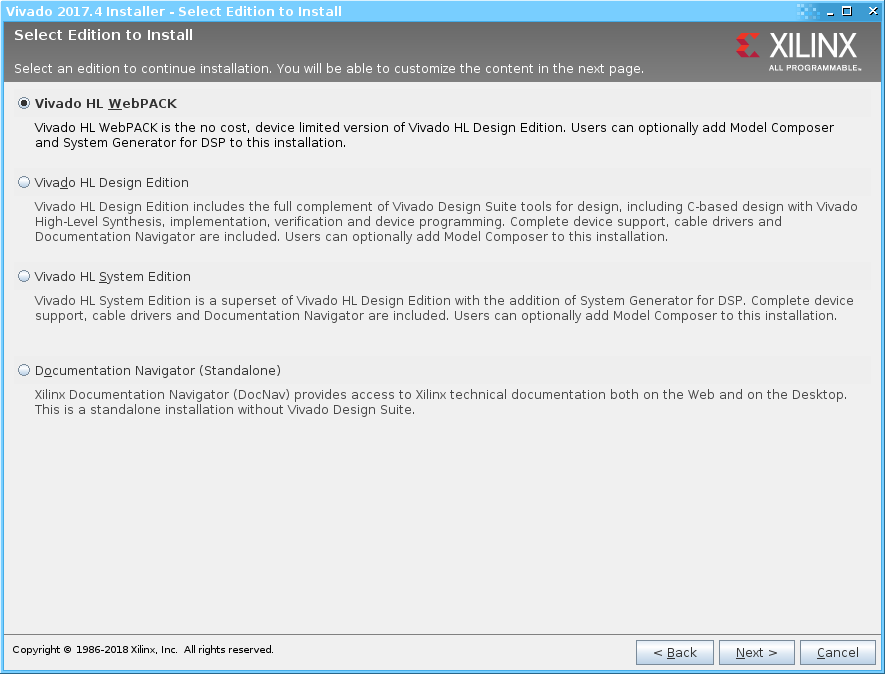

# Vivado Installation (2017.2, 2017.4)

## Download
- You need to have a Xilinx account, then
  - Download [2017.2](https://www.xilinx.com/support/download/index.html/content/xilinx/en/downloadNav/vivado-design-tools/archive.html), or
  - Download [2017.4](https://www.xilinx.com/support/download/index.html/content/xilinx/en/downloadNav/vivado-design-tools/2017-4.html)
- There are two packages to download:
  1. Full installer
  2. Update packagex

## Install
- Extract the tar.gz file, and run
  - ```xsetup.exe``` if you are installing on Windows 
  - ```xsetup``` if you are installing on Linux.

- Follow the installation direction and make sure you choose **WebPACK** edition:



- Once the installation is complete, extract and install the update.

## Potential Problem:
- [Fix](https://www.xilinx.com/support/answers/69908.html) for "R6025 Runtime Error".
- Remove missing files:
  - If you need to remove / clear missing files from a project, run the following command in TcL console:
    
    ```tcl
    remove_files [get_files -filter {IS_AVAILABLE == 0}]
    ```

